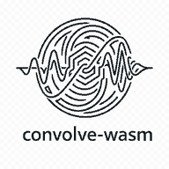

<p align="center">
  
</p>

# convolve-wasm

Client-side stereo audio convolution powered by a Rust/WASM DSP core and a dedicated browser worker. Audio is decoded and processed locally; the library does not upload source files or rendered output.

**Use the app:** <!-- site-url:start -->https://convolve-wasm.app/<!-- site-url:end -->
Redirect URL: <!-- site-url:start -->https://takana-labs.github.io/convolve-wasm/<!-- site-url:end -->

The hosted application runs the same browser-local pipeline without requiring installation. Applications can add the public API from JSR with `npx jsr add @takana-labs/convolve-wasm`.

## Install from JSR

```bash
npx jsr add @takana-labs/convolve-wasm
```

## Public API

```ts
import { CONVOLVE } from "@takana-labs/convolve-wasm";

const result = await CONVOLVE(
  { a: fileA, b: fileB },
  true,
  {
    beatPan: "a",
    panTransitionMs: 20,
    reverseCrossfadeMs: 5,
    targetDbtp: -1,
    onProgress: ({ stage, fraction }) => {
      console.log(stage, `${Math.round(fraction * 100)}%`);
    },
  },
);

const url = URL.createObjectURL(result.wav);
```

```ts
CONVOLVE(
  audio: { a: File; b: File },
  appendReverse?: boolean,
  options?: ConvolveOptions,
): Promise<ConvolveResult>
```

Accepted filename extensions are `.wav` and `.m4a`, case-insensitive. WAV is the portable baseline. M4A decoding uses the browser/operating-system codec stack through `decodeAudioData()` and can fail with `DECODE_FAILED` when the codec is unavailable.

## Processing semantics

The pipeline is fixed:

1. Decode and resample A and B to planar stereo at 48 kHz.
2. Estimate cross-layer browser peak memory and reject unsafe work before creating a worker.
3. Retain the independent Rust/WASM allocation guard at exactly 256 MiB.
4. Perform full, wet-only, channel-wise linear convolution.
5. Optionally detect beats from original A or B and extend the grid through the convolution tail.
6. Optionally collapse the convolved signal to mono and pan it left/right with equal-power gains on alternating beats.
7. Optionally append an exact sample-time reversal with a complementary midpoint crossfade.
8. Estimate true peak at 4× using a 32-tap Blackman-windowed sinc and attenuate only when necessary.
9. Encode stereo 48 kHz signed 24-bit PCM WAV.

Convolution length is `aFrames + bFrames - 1`. With reverse append and an effective crossfade of `x` frames, output length is `2 * convolutionFrames - x`.

Beat panning intentionally removes the original stereo width: the convolved stereo pair is treated as one spatial object, starts hard left, and flips only on beats strictly after the zero anchor.

## Defaults

```ts
{
  beatPan: null,
  panTransitionMs: 20,
  reverseCrossfadeMs: 5,
  targetDbtp: -1,
}
```

## Result metadata

`ConvolveResult` contains an `audio/wav` `Blob` and metadata for sample rate, channels, duration, output frames, detected beat count/BPM/confidence, applied gain, and estimated final true peak.

## Stable error codes

`INVALID_INPUT`, `UNSUPPORTED_EXTENSION`, `DECODE_FAILED`, `UNSUPPORTED_CHANNEL_COUNT`, `INPUT_TOO_LARGE`, `BEAT_DETECTION_FAILED`, `WASM_INIT_FAILED`, `PROCESSING_FAILED`, and `ENCODE_FAILED`.

## Development

Requirements: Node.js `^24.0.0`, stable Rust with `wasm32-unknown-unknown`, and `wasm-pack`.

```bash
npm ci
cargo test --workspace
npm run build:wasm
npm run test:ts
npm run build
npm run test:e2e
```

Local browser testing uses the project-owned lifecycle commands:

```bash
npm run app:doctor
npm run app:status
npm run app:start:hidden
npm run app:ready
npm run app:logs -- --tail 100
npm run app:stop
```

Lifecycle logs append under `app_work/runtime/`. Hidden start builds the demo, serves the built files on loopback, verifies readiness, and records an app-owned PID for teardown.

Generated wasm-bindgen files under `packages/convolve-wasm/src/wasm/` are build artifacts and are not committed.

See [architecture](docs/architecture.md) and [browser support](docs/browser-support.md) for implementation details and release checks.
